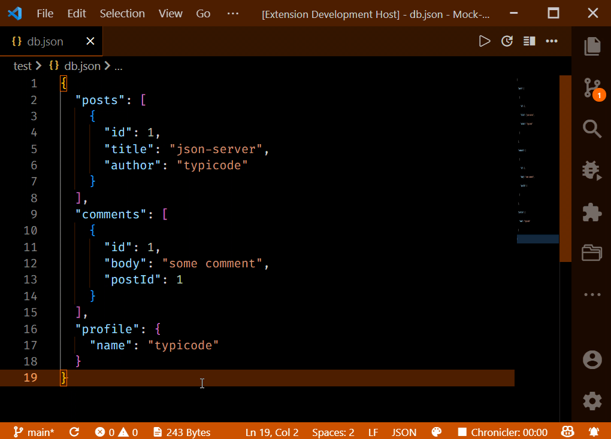

# Copy As Snippet

This Extension helps to copy multiline codes or txt as a VSCode Snippet Object.

## Features

- Select a Text to copy as Snippet and Right click and select the option `Copy as Snippet`.
- Now open the User Snippet file and paste the copied Snippet.

That's it !. No need to worry about converting a multiline text to a snippet.

## Preview
